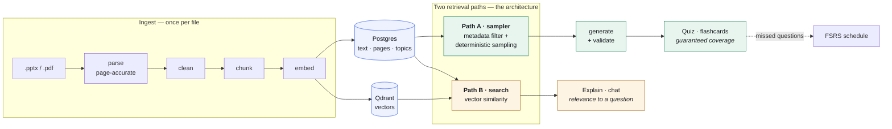

# RecitAI

<p>
  
  
  
  
  
  
  
</p>

A local-first study partner. Upload your course material; get practice questions and
flashcards drawn **only from it**, with a slide citation on every answer.

Everything runs on your machine. No course material leaves it.

> *"Quiz me on Chapter 2" should ask about Chapter 2 — all of it, not the four pages that
> happen to say "Chapter 2" the most.*

---

## Table of contents

- [Why it is built this way](#why-it-is-built-this-way)
- [What it does](#what-it-does)
- [How it fits together](#how-it-fits-together)
- [Quick start](#quick-start)
- [Bringing your own material](#bringing-your-own-material)
- [Asking questions about the material](#asking-questions-about-the-material)
- [Seeing the actual slide](#seeing-the-actual-slide)
- [Results](#results)
- [What the validator catches](#what-the-validator-catches)
- [Swapping the model](#swapping-the-model)
- [Honest limitations](#honest-limitations)
- [Layout](#layout)
- [Project documents](#project-documents)
- [Contributing](#contributing)

## Why it is built this way

A student selects "Chapter 2" and asks for a 15-question quiz.

The obvious implementation embeds the string "Chapter 2", retrieves the top 5 chunks, and
generates from those. It fails in a way that does not look like failure: the chunks that
win a similarity contest against a chapter name are the ones that *say* that name most —
the introduction. The student is quizzed on four pages of thirty, gets five definition
questions, and **nothing in the output reveals that 26 pages were skipped.**

So RecitAI has two retrieval paths, and the distinction is the architecture:

| | Path A — Coverage | Path B — Similarity |
|---|---|---|
| Mechanism | Metadata filter + deterministic sampler | Vector search |
| Used for | **Quiz and flashcard generation** | Explanations, follow-ups, finding a topic |
| Guarantees | Full coverage of the scope | Relevance to a question |

Scoping is a **filter, not a search**. When a student types free text, search *locates* the
material and the resolver then expands to the whole topic — generation never runs on the
retrieved chunks alone.

Measured: **100% topic coverage across 5 consecutive quizzes.** Asking about "Distribution
Design" draws from 59 slides, not the 5 that best match the phrase.

## How it fits together



**Quiz generation never touches Path B.** That is the single most important line in this
diagram: a similarity search cannot promise coverage, and coverage is the whole product.
[`docs/ARCHITECTURE.md`](docs/ARCHITECTURE.md) walks the same system in plain English with
eight more diagrams.

## What it does

1. **Ingest** — `.pptx` and `.pdf` become chunks with accurate page attribution.
2. **Scope** — pick a topic, or type what you want to study.
3. **Generate** — questions written only from the selected passages, each validated.
4. **Answer** — a wrong answer immediately returns *why your choice is wrong*, *why the
   right answer is right*, and the **source passage with its slide number**.
5. **Retain** — questions you miss become flashcards on an FSRS schedule.

The wrong-answer rationale is generated **with the question, not on demand** — on a local
8B model, writing it while the student waits costs 3–8 seconds, precisely where
responsiveness matters most.

## Quick start

```bash
make dev                                   # qdrant + postgres (Ollama runs natively)
ollama pull llama3.1:8b-instruct-q5_K_M
ollama pull nomic-embed-text
make install && make migrate
make smoke                                 # verifies the models actually work

make ingest F=materials C="Your Course"    # a file or a directory

make api                                   # backend on :8000
make web                                   # frontend on :3000  (in a second terminal)
```

The Next.js app is at **http://localhost:3000**. The API also serves a single-page client
at http://localhost:8000 if you would rather not run Node.

Hosted deployment is one command:

```bash
cp .env.example .env    # set POSTGRES_PASSWORD
docker compose -f docker-compose.prod.yml up -d
```

## Bringing your own material

Create a course, drop in a `.pptx` or `.pdf`, and RecitAI reads it. Questions, answers and
quizzes then come only from that course's material — a course knows nothing about any
other course's files.

The original file is kept, not discarded after reading, so the explanation panel can show
you the real slide.

A course can be removed again from the switcher. Deleting one clears its vectors and its
uploaded files before its rows, so nothing outlives it — an embedding that survives its
passage would still be retrievable, which is the closed-world guarantee broken silently.
`make reconcile` checks that Qdrant and Postgres agree, in both directions.

## Asking questions about the material

Alongside quizzes there is a chat box: ask anything about your own slides and get an
answer built only from them, with the passages it used shown first — slide images
included — so every claim can be checked.

Asked something the material does not cover, it says so and names what it *does* cover.
It never falls back on general knowledge, which for a study tool is the difference between
useful and dangerous.

This is a **v2 feature** (D-018); the spec lists chat mode as out of
scope for v1, and it was added after all nine phases were complete. It runs on Path B, so
it does not touch how quizzes are built.

## Seeing the actual slide

When you get a question wrong, the panel shows the slide it came from — not just the
extracted text. Text says what a slide *states*; only the picture shows a table's layout or
a diagram, and 12% of slides in the test corpus are diagram-only.

Three ways to get one, tried in order:

| | Needs | |
|---|---|---|
| A PDF beside the deck | one "Save as PDF" per file | `2-Background.pdf` next to `2-Background.pptx` |
| LibreOffice | `brew install --cask libreoffice` | converts automatically, cached |
| Neither | nothing | falls back to text, and says why |

Text extraction never goes through a PDF — that would lose slide numbers, headings and
speaker notes (D-008). The PDF is only ever used to draw a picture.

## Results

From `make eval` — see [docs/evaluation.md](docs/evaluation.md) for how each was measured.
Coverage and retrieval are deterministic; the generation figures vary between runs, because
the model is stochastic and the corpus is small.

| Metric | Result |
|---|---|
| **Topic coverage over 5 consecutive quizzes** | **100%** (target ≥90%) |
| Chunk coverage | 89% |
| recall@5 / MRR (Path B) | **1.00** / 0.911 over 35 hand-written pairs |
| Questions carrying resolvable citations | **100%** |
| Cited page inside its chunk and document | **100%** |
| Validator rejection rate | ~50% of first-pass generations |
| Questions judged student-ready | ~80% |
| Generation latency | p50 17 s, p95 25 s per question |
| Explanation time-to-first-token | **0.93 s** |

**The validator rejects roughly half of what the model produces.** That is the number
worth understanding: small models fail at MCQ writing in predictable, mechanically
detectable ways, and the checks that catch them are free.

## What the validator catches

Deterministic checks run first because they cost nothing; the LLM judge runs only on
survivors.

| Check | What it catches |
|---|---|
| `LENGTH_BIAS` | The correct answer padded with qualifiers — makes a quiz answerable without reading |
| `OPTION_OVERLAP` | Two options that mean the same thing |
| `LEAKAGE` | The answer's phrasing repeated in the question |
| `NEGATION` | "NOT"/"EXCEPT" outside analysis-level questions |
| `INVENTED_RANKING` | Asking for the "primary" reason when the passage ranks nothing |
| `NUMERIC_UNSUPPORTED` | A numeric answer the passage never states |
| `GROUNDED` / `UNIQUE` / `PLAUSIBLE` | LLM judge, one call per question |

The last two deterministic checks were added after measurement, and the reason is the most
useful finding in the project:

| Approach to two quality problems | Cost | Result |
|---|---|---|
| Sharpen the prompt | −40% yield | Target pattern became **more** frequent |
| Escalate to a 14B model | +36% latency, 9 GB | Did **not** fix the failure |
| **Deterministic checks** | **~0** | **Both failure classes eliminated** |

Where a failure is mechanically detectable, a regex beat both instructing a bigger model
and instructing a smaller one.

## Swapping the model

One environment variable, no code change:

```bash
GEN_MODEL=qwen2.5:14b-instruct-q4_K_M make api
```

Qwen 2.5 14B was measured (D-013): better on quality signals —
first-attempt passes 38% → 50% — but 36% slower with p95 nearly doubled, for one extra
question. 8B is retained.

## Honest limitations

- **The test corpus is small** — 5 lecture decks, 227 slides, 35 chunks. That caps a
  session at roughly 34–70 distinct questions before deduplication starts rejecting
  regenerations.
- **No speaker notes in this corpus**, so distractors are built from bullet text alone.
  About a third name a misconception thinly ("this option is not mentioned") rather than
  specifically.
- **12% of slides are diagram-only** and invisible to a text pipeline. OCR is not built.
- **~9% of questions have two defensible answers** where no superlative gives it away.
  The judge is the only thing that could catch those, and a measured attempt to sharpen it
  over-rejected badly.
- **The groundedness audit uses lexical overlap**, a weak proxy for entailment. It catches
  an explanation about something the passage never mentions; it would not catch a fluent
  misreading.
- **Generation is slow** — a 20-question quiz is about six minutes of local GPU.

## Layout

```
backend/recitai/
  ingestion/    parse -> clean -> chunk -> embed
  retrieval/    sampler (Path A) · search (Path B) · resolver · topic_map
  generation/   generator · validator · dedup · prompts
  learning/     FSRS scheduling · mastery · missed-question promotion
  api/          FastAPI routes and the answer-leak boundary
eval/           the metrics harness behind every number above
scripts/        smoke test · vector/row reconciliation
plan/           the build spec, and the decision and issue logs
docs/adr/       why the architecture is what it is
```

## Project documents

| File | What it holds |
|---|---|
| [docs/ARCHITECTURE.md](docs/ARCHITECTURE.md) | **Start here** — how the system works, in plain English, with diagrams |
| [docs/evaluation.md](docs/evaluation.md) | Full evaluation results, and what they do not show |
| [docs/adr/](docs/adr/) | The three architectural decisions, in full |

Comments throughout the code cite a decision (`D-0NN`) or an issue (`I-0NN`). Those refer
to the build spec and its decision, issue and progress logs, which are kept outside this
repository — the identifiers are retained because they are how the reasoning is indexed,
and `docs/ARCHITECTURE.md` and `docs/evaluation.md` carry the substance that matters to a
reader here.

Some of what those logs record: a parser that silently flattened every slide onto one page,
vector payloads that never received their topic id so scoping quietly degraded to the whole
course, integration tests that reported green while skipping, and Symbol-font characters
that removed the operators from every formula in 63% of the corpus.


## Contributing

[`CONTRIBUTING.md`](CONTRIBUTING.md) covers the setup, the checks a change has to pass, and
the six invariants that constrain the code more than any style guide does. Two conventions
are worth knowing before you start: quiz generation must never use vector search, and a
change to generation quality is not accepted without a seeded A/B — two changes have
already been reverted on measurement rather than opinion.

Security issues: see [`SECURITY.md`](SECURITY.md). RecitAI assumes a single trusted local
user and has no authentication, so do not expose it to a network you do not control.
