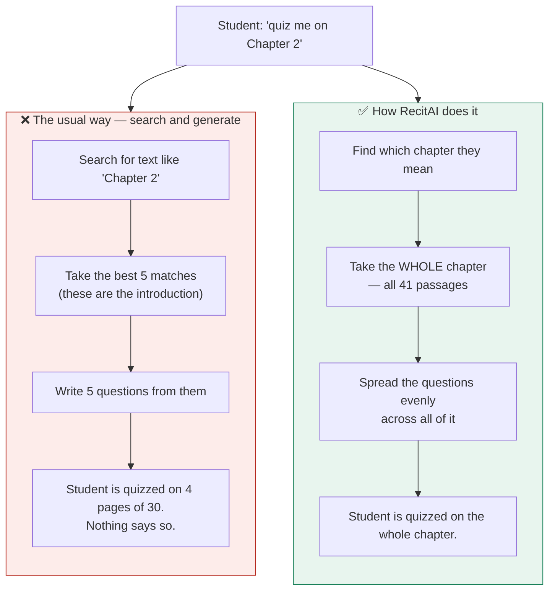
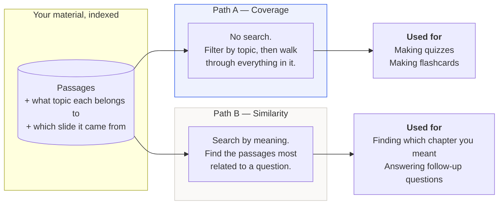
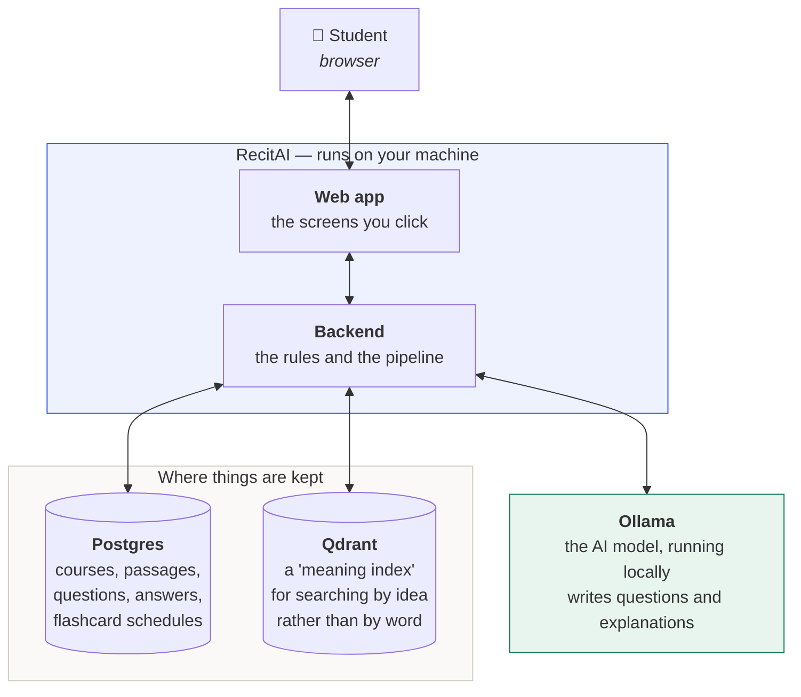
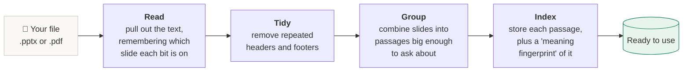
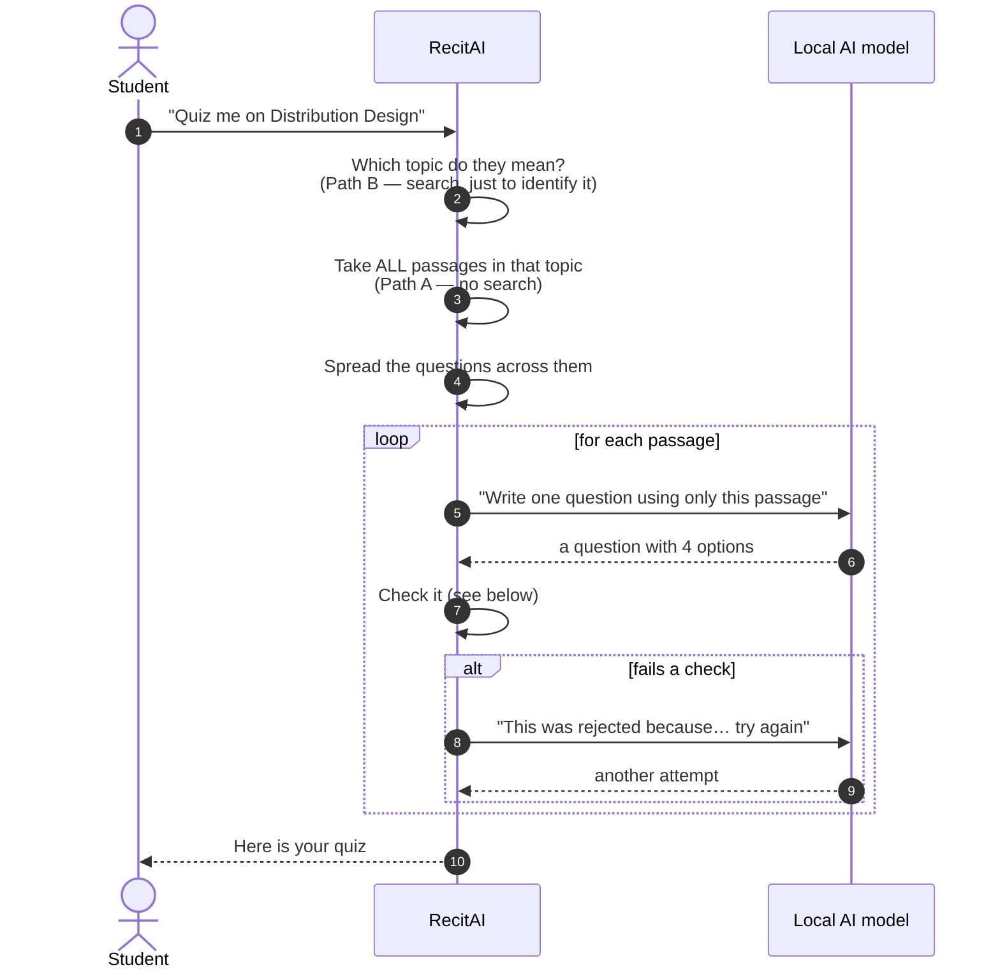
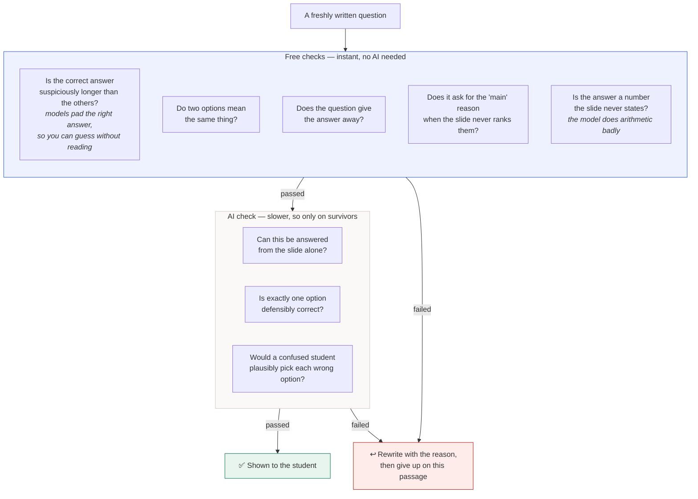
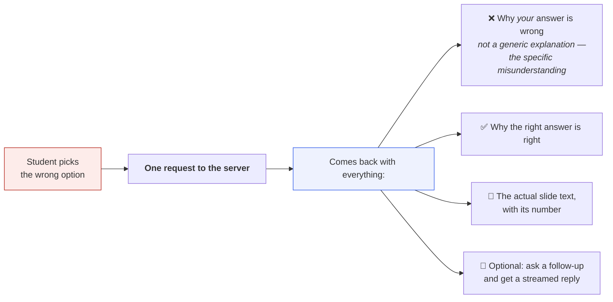
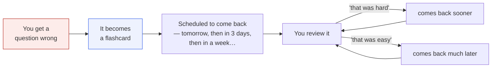

# How RecitAI works

A plain-English tour of the system. No prior knowledge assumed.

---

## 1. What it does

You give RecitAI your course material — lecture slides or a PDF. It reads them, then makes
practice questions **only from what is in those files**. When you get one wrong, it tells
you why your answer was wrong, why the right one is right, and shows you the exact slide it
came from.

Everything runs on your own computer. Your course material never leaves it.

---

## 2. The one idea that matters

Most systems like this work by **searching**. You ask for "Chapter 2", it searches for
passages that look like "Chapter 2", takes the best five, and writes questions from those.

That sounds reasonable and it quietly fails.

The passages that best match the words "Chapter 2" are the ones that *say* "Chapter 2"
most often — which is the **introduction**. So you get five questions about the opening
paragraphs and nothing about the rest of the chapter. The quiz looks fine. Nothing tells
you that 26 of 30 pages were never considered.

RecitAI does something different: **choosing what to study is a filter, not a search.**

Search is still used — but only to **find** the chapter, never to decide what you are
tested on. Once the chapter is identified, a separate component walks through all of it.

We measured this: **100% of topics are covered across five consecutive quizzes.** Asking
about "Distribution Design" draws questions from all 64 of its slides, not from the 5 that best match
the phrase.

---

## 3. The two paths

Because of that idea, the system has two different ways of getting at your material. They
read the same data; they just ask different questions of it.

**Path A guarantees coverage.** **Path B guarantees relevance.** Using the wrong one for
the wrong job is the mistake this whole design exists to avoid.

---

## 4. The whole system

Four pieces, and each has one job:

| Piece | What it is | Why it is there |
|---|---|---|
| **Backend** | The program with all the logic | Decides what to ask you about, and checks the questions are good |
| **Postgres** | An ordinary database | Remembers your courses, questions, answers and flashcard schedule |
| **Qdrant** | A "meaning index" | Lets the system find passages by *idea*, not by matching words |
| **Ollama** | The AI model, running locally | Writes the questions and the explanations |

The last one is the important bit: **the AI runs on your machine.** Nothing is sent to a
company's servers.

---

## 5. Getting your material in

Before anything can happen, your slides have to be turned into something the system can
work with.

**Remembering the slide number is the part that matters most.** It is what lets the system
show you the source later. If that were wrong, every citation would be wrong, and you would
stop trusting all of them — so it is checked directly: every passage's text must actually
appear on the slides it claims.

One real detail: a single slide is usually too thin to ask a good question about — a bullet
list of six words. So consecutive slides are combined into passages of roughly the right
size. On the test material this turned 227 slides into 35 passages.

---

## 6. Making a quiz

Generating takes about 20 seconds per question, so it runs in the background and the screen
shows progress rather than freezing.

---

## 7. Checking the questions

This is the part most people skip, and it is the reason the questions are usable.

A small AI model writes bad multiple-choice questions in **predictable** ways. Predictable
means detectable. So every question is checked before you ever see it — and **about half
are rejected and rewritten.**

The cheap checks run first **because they are free**, and they turned out to be the most
effective. Two problems we tried to fix by giving the AI better instructions got *worse*;
trying a bigger, slower AI model did not fix them either. A few lines of pattern-matching
fixed both, instantly and at no cost.

---

## 8. When you get one wrong

This is the moment the product exists for.

Two deliberate choices here:

**The explanation is written in advance, with the question.** Not when you click. On a
local AI model, writing it while you wait would take 3–8 seconds — right at the moment you
are most likely to give up. Doing it early makes the response instant.

**You can check it yourself.** The slide number is shown, so if the AI is wrong you can see
that in two seconds. For a system running a small local model, being *checkable* matters
more than being confident.

---

## 9. Questions you miss become flashcards

The scheduling uses **FSRS**, a well-tested spaced-repetition algorithm — the same family
of method used by serious flashcard apps. The idea is simple: you see things just before
you would have forgotten them, so you spend your time on what you actually don't know.

The link between the two halves is the point. Getting something wrong once teaches you
little; meeting it four more times over two weeks is what makes it stick.

---

## 10. How to explain it in thirty seconds

> RecitAI turns your lecture slides into practice questions. It runs entirely on your own
> computer, so your material stays private.
>
> The clever part is what it does *not* do. Most systems search your notes for whatever
> you asked about and quiz you on the best matches — which are almost always the
> introduction, so you get tested on the first few pages and never know it. RecitAI uses
> search only to work out which chapter you meant, then deliberately walks through the
> whole thing. We measured it: every topic gets covered.
>
> Small AI models write bad quiz questions in predictable ways — padding the right answer
> so you can guess it, writing two options that mean the same thing. So every question is
> checked before you see it, and about half get thrown away and rewritten.
>
> When you get one wrong it tells you why *your* answer was wrong, not just what the right
> one was, and it shows you the exact slide — so you can check it. Then it turns that
> question into a flashcard and brings it back on a schedule until you know it.

---

## Where to look next

| To understand… | Read |
|---|---|
| Why the two paths exist | [`docs/adr/0001-two-path-retrieval.md`](adr/0001-two-path-retrieval.md) |
| The measured results | [`docs/evaluation.md`](evaluation.md) |
| Why no RAG framework | [`docs/adr/0002-no-rag-framework.md`](adr/0002-no-rag-framework.md) |
| How to work on it | [`CONTRIBUTING.md`](../CONTRIBUTING.md) |

The `D-0NN` and `I-0NN` identifiers cited throughout the code index a decision log and an
issue register kept outside this repository.
